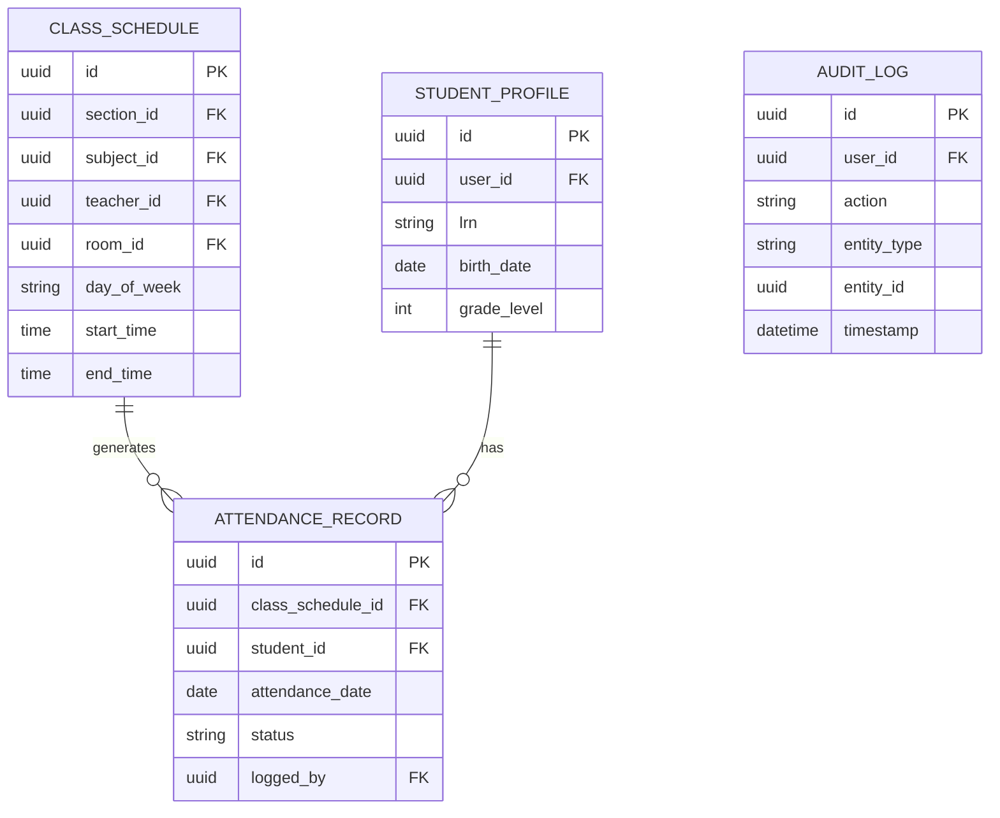
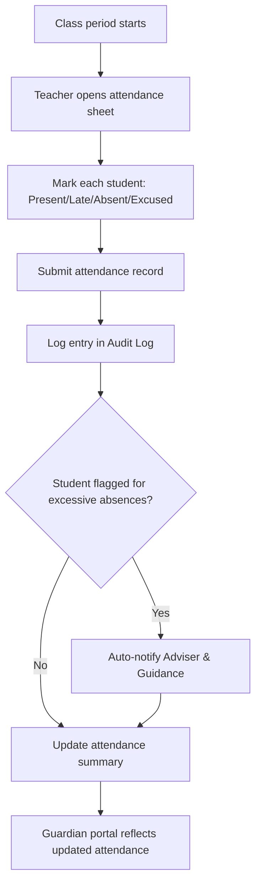

# Module 4: Attendance

## System Overview

This file is one module out of a set of module-context files for the **Senior High School LMS**
— a Learning Management System for Grades 11–12 under the Philippine K-12 Tracks/Strands
curriculum (Academic, TVL, Sports, Arts & Design tracks; STEM, ABM, HUMSS, GAS, etc. strands),
adaptable to any SHS setup.

**Tech stack:** Laravel (backend/API) + Vue.js (frontend SPA). See **Section 0 — Tech Stack** in
[`senior-high-school-lms-plan.md`](../senior-high-school-lms-plan.md) for the full stack decision,
the strict scalability/readability rule that governs all code in this project, and an explanation
of the Laravel file structure.

**Full plan:** [`senior-high-school-lms-plan.md`](../senior-high-school-lms-plan.md) contains
the complete module list, the full ERD, all module flowcharts, cross-cutting considerations,
and build phases. This file extracts and expands only what's relevant to this one module so it
can be handed to a developer (or an AI coding assistant) as a self-contained brief.

---

## Function
Daily/per-subject attendance logging, absence/tardy tracking, and automated alerts to guardians.

**Keep in mind:**
- SHS often tracks attendance per subject period, not just once a day.
- Needs an audit trail (who logged/edited an entry and when) — this feeds into official DepEd forms.
- Excessive absence triggers should notify Guidance/Adviser automatically.

---

## Data Model (relevant slice of the master ERD)

---

## Module Flow

---

## Cross-Cutting Concerns That Apply Here

- **Auditability:** Grades, attendance, and guidance records all need "who changed what, when" trails — build this in from the start, it's expensive to bolt on later.
- **Offline resilience:** Design APIs to tolerate spotty connections (queue submissions, retry uploads).

---

## Build Phase

**Phase 2 — Daily Operations** (see the master plan's Suggested Build Phases for the full sequence).

---

## Implementation Notes

Attendance is logged per CLASS_SCHEDULE occurrence, not once a day — design the table and queries around that from the start.

---

## Related Modules

- [Module 3: Class & Scheduling](./03-class-scheduling.md)
- [Module 10: Guidance & Counseling](./10-guidance-counseling.md)
- [Module 13: Reports & Analytics](./13-reports-analytics.md)
- [Module 14: Notifications & Alerts](./14-notifications-alerts.md)
