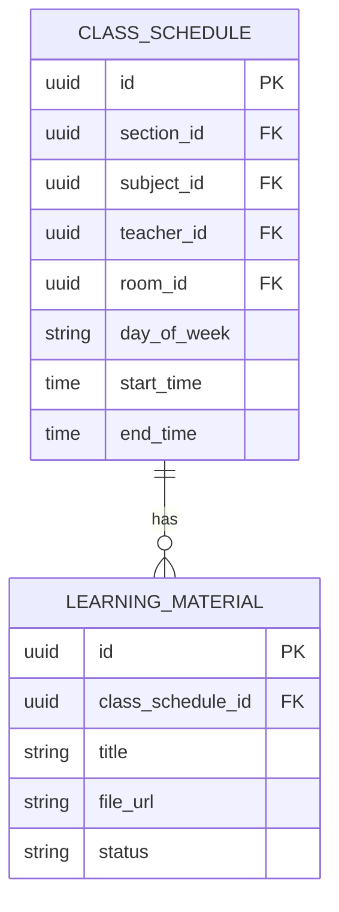
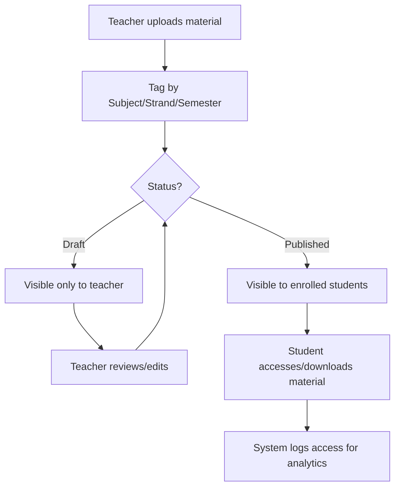

# Module 5: Content & Learning Materials

## System Overview

This file is one module out of a set of module-context files for the **Senior High School LMS**
— a Learning Management System for Grades 11–12 under the Philippine K-12 Tracks/Strands
curriculum (Academic, TVL, Sports, Arts & Design tracks; STEM, ABM, HUMSS, GAS, etc. strands),
adaptable to any SHS setup.

**Tech stack:** Laravel (backend/API) + Vue.js (frontend SPA). See **Section 0 — Tech Stack** in
[`senior-high-school-lms-plan.md`](../senior-high-school-lms-plan.md) for the full stack decision,
the strict scalability/readability rule that governs all code in this project, and an explanation
of the Laravel file structure.

**Full plan:** [`senior-high-school-lms-plan.md`](../senior-high-school-lms-plan.md) contains
the complete module list, the full ERD, all module flowcharts, cross-cutting considerations,
and build phases. This file extracts and expands only what's relevant to this one module so it
can be handed to a developer (or an AI coding assistant) as a self-contained brief.

---

## Function
Upload/organize modules, videos, slides, and self-learning kits per subject; versioning of materials.

**Keep in mind:**
- Support offline-friendly formats (many SHS students have limited connectivity) — downloadable PDFs, low-bandwidth video links.
- Materials should be scoped by subject + strand + semester, not a flat file dump.
- Access control: draft vs published content.

---

## Data Model (relevant slice of the master ERD)

---

## Module Flow

---

## Cross-Cutting Concerns That Apply Here

- **Offline resilience:** Design APIs to tolerate spotty connections (queue submissions, retry uploads).
- **Accessibility:** Screen-reader support and low-bandwidth modes matter for equitable access.

---

## Build Phase

**Phase 2 — Daily Operations** (see the master plan's Suggested Build Phases for the full sequence).

---

## Implementation Notes

Keep storage abstracted (Laravel Filesystem/S3-compatible driver) so large media files don't bloat the primary database or the app server disk.

---

## Related Modules

- [Module 3: Class & Scheduling](./03-class-scheduling.md)
- [Module 6: Assignments, Quizzes & Assessments](./06-assignments-quizzes-assessments.md)
