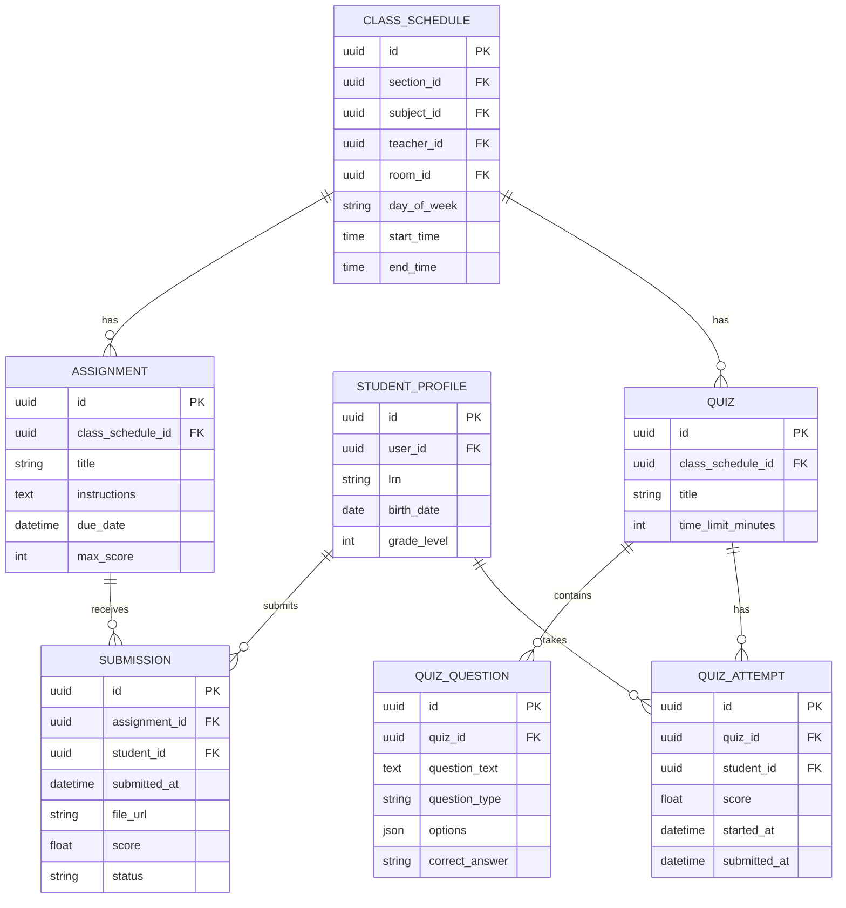
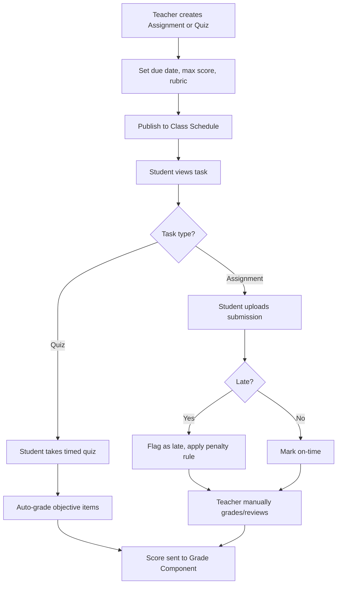

# Module 6: Assignments, Quizzes & Assessments

## System Overview

This file is one module out of a set of module-context files for the **Senior High School LMS**
— a Learning Management System for Grades 11–12 under the Philippine K-12 Tracks/Strands
curriculum (Academic, TVL, Sports, Arts & Design tracks; STEM, ABM, HUMSS, GAS, etc. strands),
adaptable to any SHS setup.

**Tech stack:** Laravel (backend/API) + Vue.js (frontend SPA). See **Section 0 — Tech Stack** in
[`senior-high-school-lms-plan.md`](../senior-high-school-lms-plan.md) for the full stack decision,
the strict scalability/readability rule that governs all code in this project, and an explanation
of the Laravel file structure.

**Full plan:** [`senior-high-school-lms-plan.md`](../senior-high-school-lms-plan.md) contains
the complete module list, the full ERD, all module flowcharts, cross-cutting considerations,
and build phases. This file extracts and expands only what's relevant to this one module so it
can be handed to a developer (or an AI coding assistant) as a self-contained brief.

---

## Function
Create/distribute tasks, auto-graded quizzes (MCQ, T/F), manually-graded essays/performance tasks, rubric-based scoring, submission tracking, plagiarism/late-submission flags.

**Keep in mind:**
- Philippine DepEd grading uses **Written Work, Performance Tasks, and Quarterly/Semestral Exams** with weighted percentages that differ by subject type (Academic Track vs TVL) — the grading engine must support configurable weight templates.
- Support rubric grading for performance-based/portfolio tasks (common in TVL and Arts & Design strands).

---

## Data Model (relevant slice of the master ERD)

---

## Module Flow

---

## Cross-Cutting Concerns That Apply Here

- **Scalability of grading rules:** Different strands/tracks have different weight formulas — model this as data (a "Grading Template" table), not code.
- **Offline resilience:** Design APIs to tolerate spotty connections (queue submissions, retry uploads).

---

## Build Phase

**Phase 3 — Academics Core** (see the master plan's Suggested Build Phases for the full sequence).

---

## Implementation Notes

SUBMISSION and QUIZ_ATTEMPT both feed into GRADE_COMPONENT (module 7) — keep the scoring contract between these modules explicit and versioned.

---

## Related Modules

- [Module 5: Content & Learning Materials](./05-content-learning-materials.md)
- [Module 7: Grading & Report Cards](./07-grading-report-cards.md)
