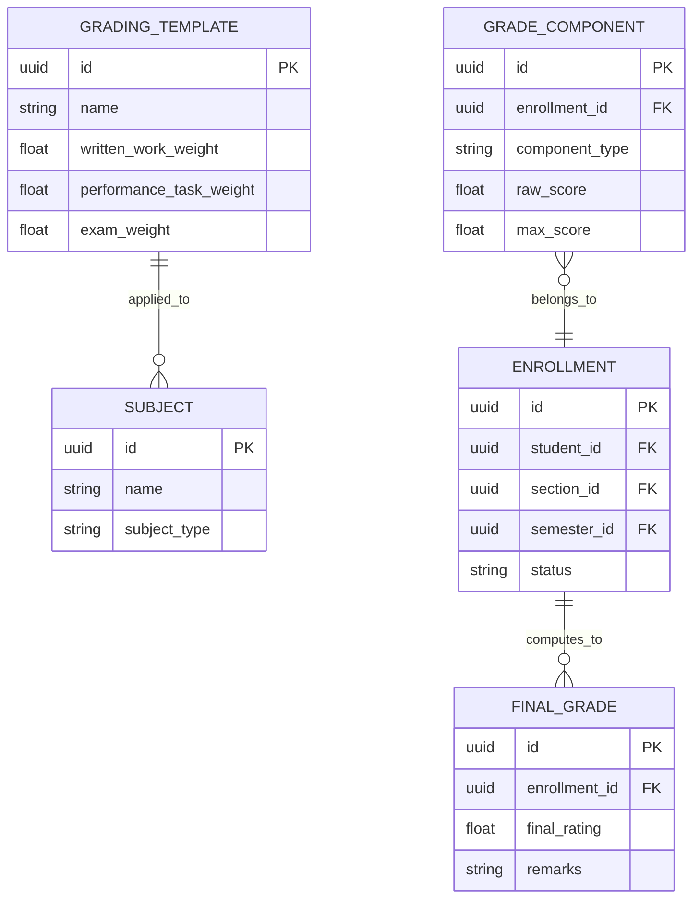
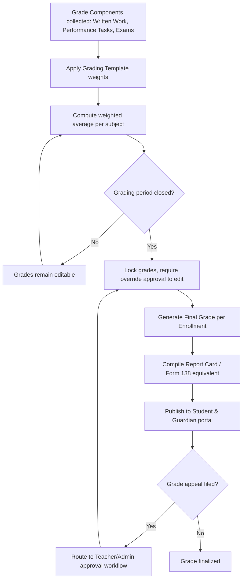

# Module 7: Grading & Report Cards

## System Overview

This file is one module out of a set of module-context files for the **Senior High School LMS**
— a Learning Management System for Grades 11–12 under the Philippine K-12 Tracks/Strands
curriculum (Academic, TVL, Sports, Arts & Design tracks; STEM, ABM, HUMSS, GAS, etc. strands),
adaptable to any SHS setup.

**Tech stack:** Laravel (backend/API) + Vue.js (frontend SPA). See **Section 0 — Tech Stack** in
[`senior-high-school-lms-plan.md`](../senior-high-school-lms-plan.md) for the full stack decision,
the strict scalability/readability rule that governs all code in this project, and an explanation
of the Laravel file structure.

**Full plan:** [`senior-high-school-lms-plan.md`](../senior-high-school-lms-plan.md) contains
the complete module list, the full ERD, all module flowcharts, cross-cutting considerations,
and build phases. This file extracts and expands only what's relevant to this one module so it
can be handed to a developer (or an AI coding assistant) as a self-contained brief.

---

## Function
Computes final grades using weighted components, generates report cards (equivalent to DepEd SF9/Form 138), computes GPA, and generates official transcripts.

**Keep in mind:**
- Grade computation formulas must be configurable per subject/strand — don't hardcode a single formula.
- Historical grade locking (once a grading period closes, grades shouldn't be silently editable — require an override/audit log).
- Support grade appeals/correction workflow with approval trail.

---

## Data Model (relevant slice of the master ERD)

---

## Module Flow

---

## Cross-Cutting Concerns That Apply Here

- **Scalability of grading rules:** Different strands/tracks have different weight formulas — model this as data (a "Grading Template" table), not code.
- **Auditability:** Grades, attendance, and guidance records all need "who changed what, when" trails — build this in from the start, it's expensive to bolt on later.

---

## Build Phase

**Phase 3 — Academics Core** (see the master plan's Suggested Build Phases for the full sequence).

---

## Implementation Notes

The highest-risk module for hardcoded logic. GRADING_TEMPLATE must be data-driven so DepEd weight changes never require a code deploy.

---

## Related Modules

- [Module 2: Enrollment & Academic Structure](./02-enrollment-academic-structure.md)
- [Module 6: Assignments, Quizzes & Assessments](./06-assignments-quizzes-assessments.md)
- [Module 13: Reports & Analytics](./13-reports-analytics.md)
