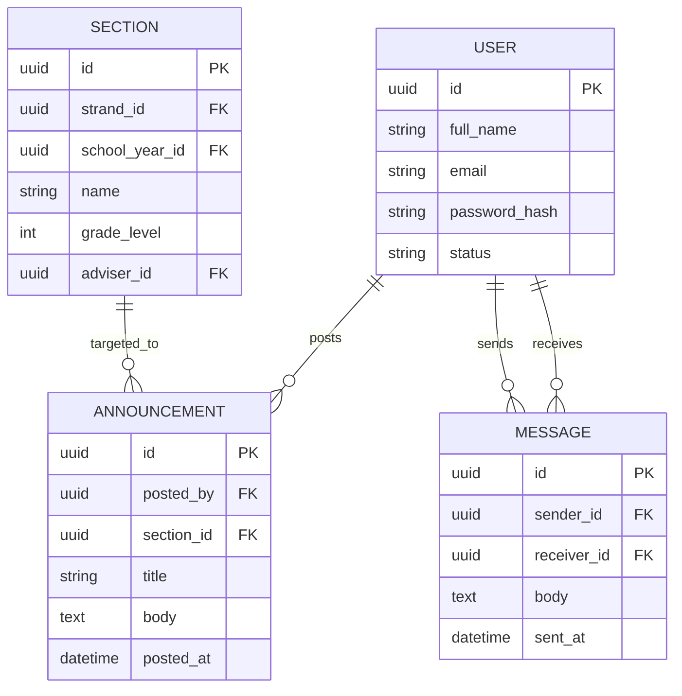
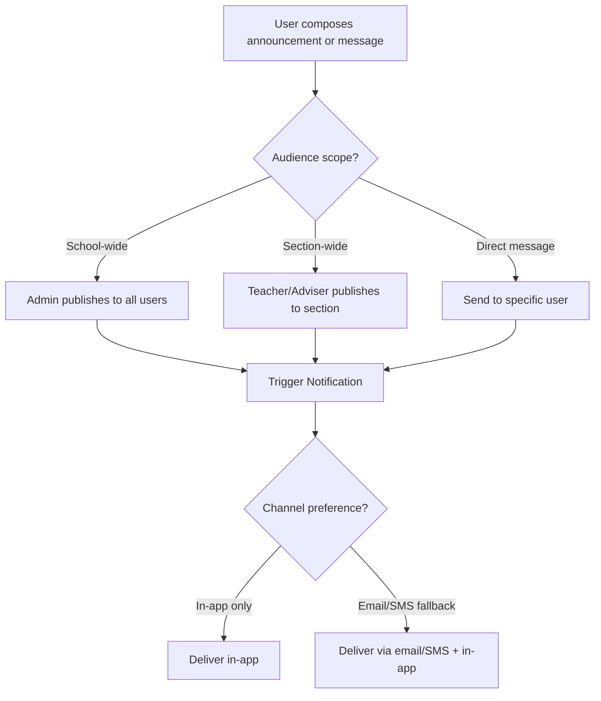

# Module 8: Communication & Announcements

## System Overview

This file is one module out of a set of module-context files for the **Senior High School LMS**
— a Learning Management System for Grades 11–12 under the Philippine K-12 Tracks/Strands
curriculum (Academic, TVL, Sports, Arts & Design tracks; STEM, ABM, HUMSS, GAS, etc. strands),
adaptable to any SHS setup.

**Tech stack:** Laravel (backend/API) + Vue.js (frontend SPA). See **Section 0 — Tech Stack** in
[`senior-high-school-lms-plan.md`](../senior-high-school-lms-plan.md) for the full stack decision,
the strict scalability/readability rule that governs all code in this project, and an explanation
of the Laravel file structure.

**Full plan:** [`senior-high-school-lms-plan.md`](../senior-high-school-lms-plan.md) contains
the complete module list, the full ERD, all module flowcharts, cross-cutting considerations,
and build phases. This file extracts and expands only what's relevant to this one module so it
can be handed to a developer (or an AI coding assistant) as a self-contained brief.

---

## Function
School-wide, section-wide, and subject-specific announcements; direct messaging between teachers/students/guardians; emergency broadcast (e.g., class suspension).

**Keep in mind:**
- Guardians should get a simplified/read-only channel, not full access to internal teacher discussions.
- Push/SMS/email fallback matters — not everyone checks the portal daily.

---

## Data Model (relevant slice of the master ERD)

---

## Module Flow

---

## Cross-Cutting Concerns That Apply Here

- **Offline resilience:** Design APIs to tolerate spotty connections (queue submissions, retry uploads).
- **Localization:** Support Filipino/English bilingual UI if targeting Philippine public schools.

---

## Build Phase

**Phase 4 — Engagement** (see the master plan's Suggested Build Phases for the full sequence).

---

## Implementation Notes

Every announcement/message should raise a NOTIFICATION event (module 14) rather than pushing directly — keep delivery channels decoupled from content creation.

---

## Related Modules

- [Module 1: User & Role Management](./01-user-role-management.md)
- [Module 12: Parent/Guardian Portal](./12-parent-guardian-portal.md)
- [Module 14: Notifications & Alerts](./14-notifications-alerts.md)
