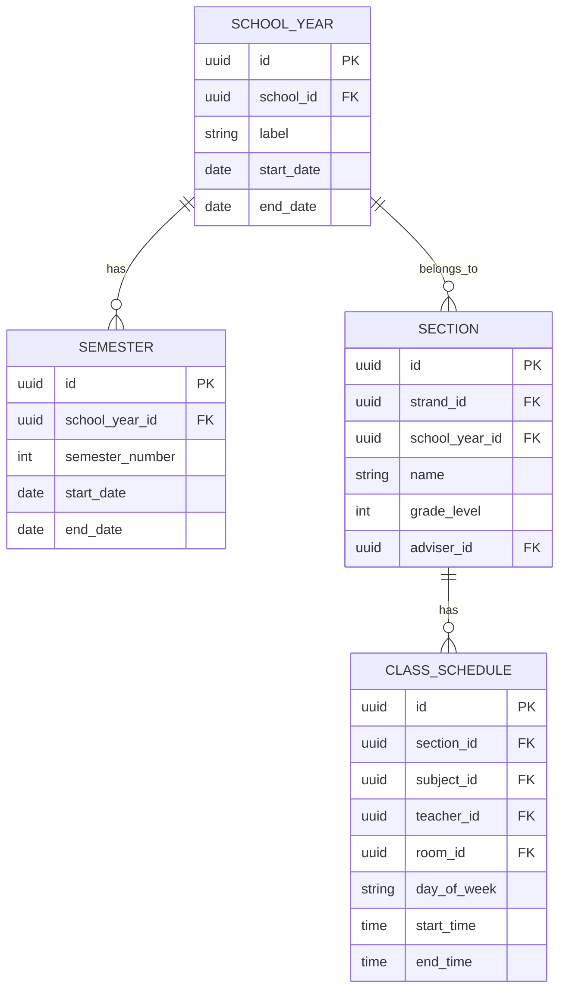
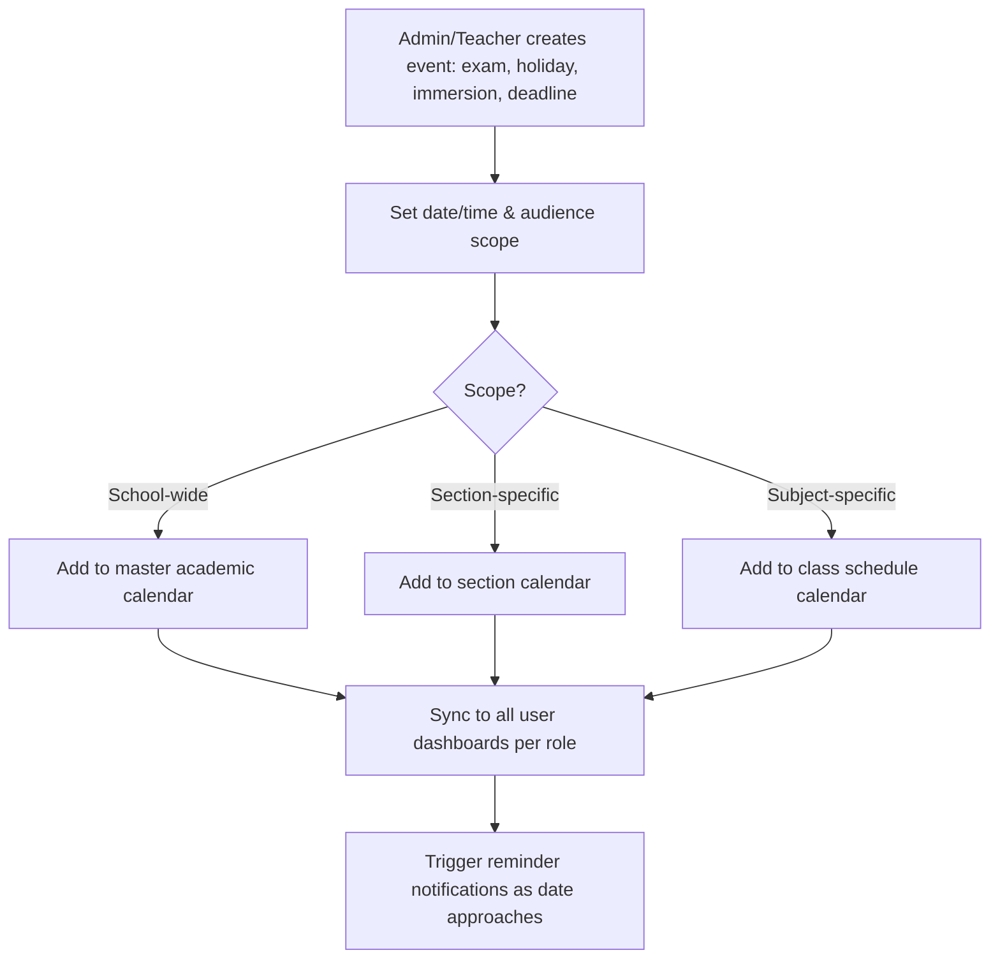

# Module 9: Calendar & Events

## System Overview

This file is one module out of a set of module-context files for the **Senior High School LMS**
— a Learning Management System for Grades 11–12 under the Philippine K-12 Tracks/Strands
curriculum (Academic, TVL, Sports, Arts & Design tracks; STEM, ABM, HUMSS, GAS, etc. strands),
adaptable to any SHS setup.

**Tech stack:** Laravel (backend/API) + Vue.js (frontend SPA). See **Section 0 — Tech Stack** in
[`senior-high-school-lms-plan.md`](../senior-high-school-lms-plan.md) for the full stack decision,
the strict scalability/readability rule that governs all code in this project, and an explanation
of the Laravel file structure.

**Full plan:** [`senior-high-school-lms-plan.md`](../senior-high-school-lms-plan.md) contains
the complete module list, the full ERD, all module flowcharts, cross-cutting considerations,
and build phases. This file extracts and expands only what's relevant to this one module so it
can be handed to a developer (or an AI coding assistant) as a self-contained brief.

---

## Function
Academic calendar, exam schedules, holidays, deadlines, school events, immersion schedules.

**Keep in mind:**
- Should sync per-role (a student sees their own section's events; a teacher sees all sections they handle).

---

## Data Model (relevant slice of the master ERD)

---

## Module Flow

---

## Cross-Cutting Concerns That Apply Here

- **Localization:** Support Filipino/English bilingual UI if targeting Philippine public schools.

---

## Build Phase

**Phase 4 — Engagement** (see the master plan's Suggested Build Phases for the full sequence).

---

## Implementation Notes

GAP: the current ERD (section 4) has no dedicated EVENT table — Calendar reuses SECTION/CLASS_SCHEDULE dates today. Add an EVENT entity (title, scope, date range, audience) before building this module so holidays/exams/immersion aren't shoehorned into scheduling tables.

---

## Related Modules

- [Module 3: Class & Scheduling](./03-class-scheduling.md)
- [Module 14: Notifications & Alerts](./14-notifications-alerts.md)
