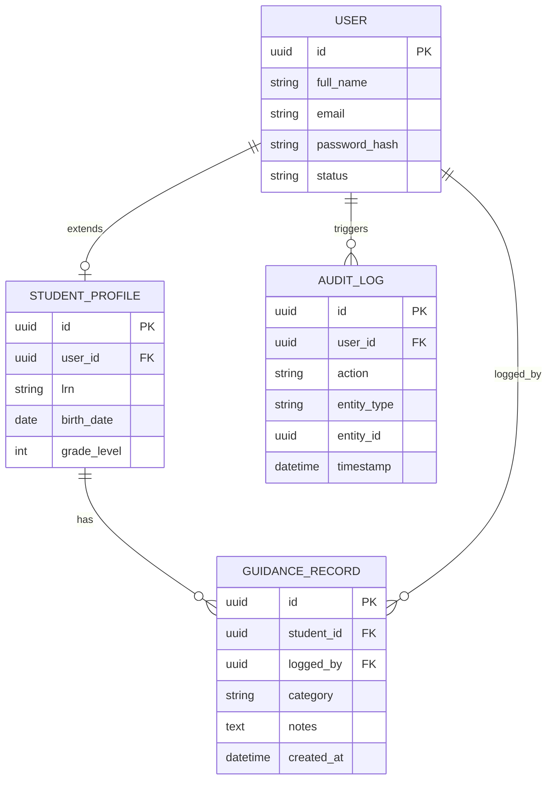
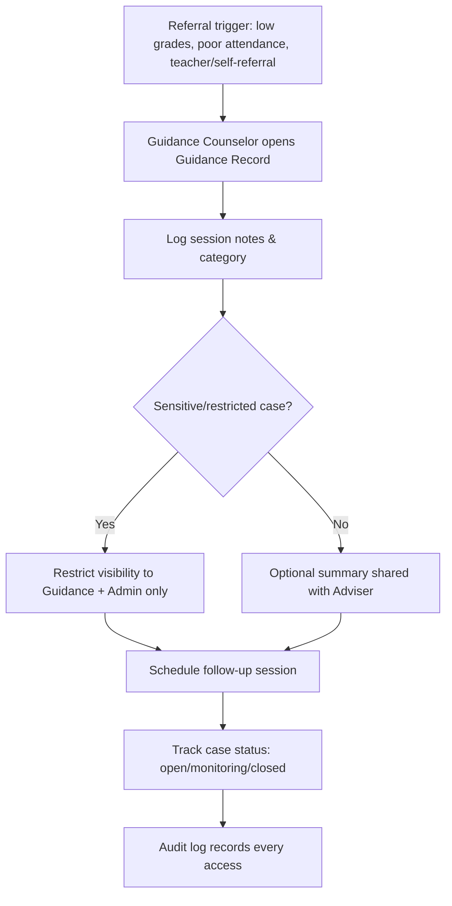

# Module 10: Guidance & Counseling

## System Overview

This file is one module out of a set of module-context files for the **Senior High School LMS**
— a Learning Management System for Grades 11–12 under the Philippine K-12 Tracks/Strands
curriculum (Academic, TVL, Sports, Arts & Design tracks; STEM, ABM, HUMSS, GAS, etc. strands),
adaptable to any SHS setup.

**Tech stack:** Laravel (backend/API) + Vue.js (frontend SPA). See **Section 0 — Tech Stack** in
[`senior-high-school-lms-plan.md`](../senior-high-school-lms-plan.md) for the full stack decision,
the strict scalability/readability rule that governs all code in this project, and an explanation
of the Laravel file structure.

**Full plan:** [`senior-high-school-lms-plan.md`](../senior-high-school-lms-plan.md) contains
the complete module list, the full ERD, all module flowcharts, cross-cutting considerations,
and build phases. This file extracts and expands only what's relevant to this one module so it
can be handed to a developer (or an AI coding assistant) as a self-contained brief.

---

## Function
Tracks behavioral records, counseling session logs, career guidance notes (especially relevant since SHS is meant to prepare students for college/work/entrepreneurship).

**Keep in mind:**
- Highest sensitivity data in the system — restrict to Guidance role + Admin only, with strict audit logging.
- Should never be visible to regular subject teachers by default.

---

## Data Model (relevant slice of the master ERD)

---

## Module Flow

---

## Cross-Cutting Concerns That Apply Here

- **Data privacy:** Student data (especially minors) requires strict compliance (e.g., Philippine Data Privacy Act / DPA 2012, or GDPR/FERPA equivalents if international). Encrypt sensitive fields, log all access to guidance/counseling records.
- **Auditability:** Grades, attendance, and guidance records all need "who changed what, when" trails — build this in from the start, it's expensive to bolt on later.

---

## Build Phase

**Phase 5 — Oversight** (see the master plan's Suggested Build Phases for the full sequence).

---

## Implementation Notes

Highest-sensitivity module in the system. Every read of GUIDANCE_RECORD must write an AUDIT_LOG row — enforce this at the repository/service layer, not just in policies.

---

## Related Modules

- [Module 1: User & Role Management](./01-user-role-management.md)
- [Module 4: Attendance](./04-attendance.md)
- [Module 13: Reports & Analytics](./13-reports-analytics.md)
