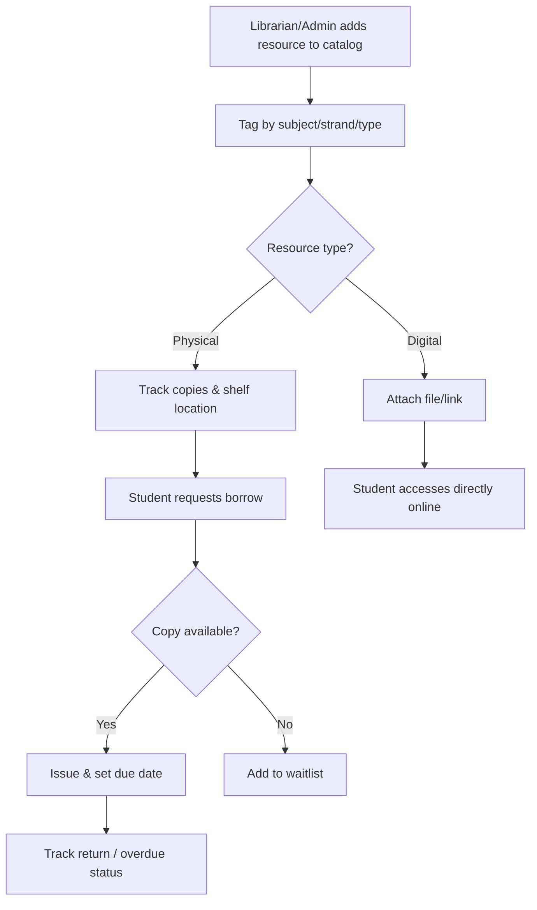

# Module 11: Library / Resource Management (optional but common)

## System Overview

This file is one module out of a set of module-context files for the **Senior High School LMS**
— a Learning Management System for Grades 11–12 under the Philippine K-12 Tracks/Strands
curriculum (Academic, TVL, Sports, Arts & Design tracks; STEM, ABM, HUMSS, GAS, etc. strands),
adaptable to any SHS setup.

**Tech stack:** Laravel (backend/API) + Vue.js (frontend SPA). See **Section 0 — Tech Stack** in
[`senior-high-school-lms-plan.md`](../senior-high-school-lms-plan.md) for the full stack decision,
the strict scalability/readability rule that governs all code in this project, and an explanation
of the Laravel file structure.

**Full plan:** [`senior-high-school-lms-plan.md`](../senior-high-school-lms-plan.md) contains
the complete module list, the full ERD, all module flowcharts, cross-cutting considerations,
and build phases. This file extracts and expands only what's relevant to this one module so it
can be handed to a developer (or an AI coding assistant) as a self-contained brief.

---

## Function
Digital or physical library catalog, borrowing records, e-book/resource links tied to subjects.

---

## Data Model (relevant slice of the master ERD)

> **Not yet modeled.** This module has no dedicated entities in the master ERD (`senior-high-school-lms-plan.md`, section 4) yet. Design its tables as part of implementing this module, and add them back to the master ERD once finalized.

---

## Module Flow

---

## Cross-Cutting Concerns That Apply Here

- **Offline resilience:** Design APIs to tolerate spotty connections (queue submissions, retry uploads).

---

## Build Phase

**Phase 5 — Oversight** (see the master plan's Suggested Build Phases for the full sequence).

---

## Implementation Notes

GAP: not modeled in the current ERD (section 4) at all. This module needs its own entities — e.g. LIBRARY_ITEM, LIBRARY_COPY, BORROW_RECORD — before implementation starts. Optional/lower priority per the build phases.

---

## Related Modules

- [Module 5: Content & Learning Materials](./05-content-learning-materials.md)
