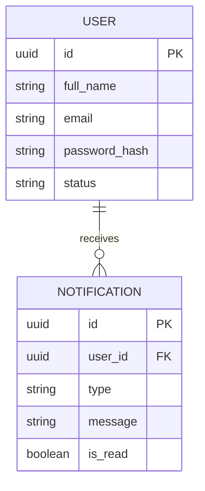

# Module 14: Notifications & Alerts

## System Overview

This file is one module out of a set of module-context files for the **Senior High School LMS**
— a Learning Management System for Grades 11–12 under the Philippine K-12 Tracks/Strands
curriculum (Academic, TVL, Sports, Arts & Design tracks; STEM, ABM, HUMSS, GAS, etc. strands),
adaptable to any SHS setup.

**Tech stack:** Laravel (backend/API) + Vue.js (frontend SPA). See **Section 0 — Tech Stack** in
[`senior-high-school-lms-plan.md`](../senior-high-school-lms-plan.md) for the full stack decision,
the strict scalability/readability rule that governs all code in this project, and an explanation
of the Laravel file structure.

**Full plan:** [`senior-high-school-lms-plan.md`](../senior-high-school-lms-plan.md) contains
the complete module list, the full ERD, all module flowcharts, cross-cutting considerations,
and build phases. This file extracts and expands only what's relevant to this one module so it
can be handed to a developer (or an AI coding assistant) as a self-contained brief.

---

## Function
Centralized notification engine (in-app, email, SMS) for deadlines, grades posted, low attendance, announcements.

---

## Data Model (relevant slice of the master ERD)



---

## Module Flow

```mermaid
flowchart TD
    A[Trigger event occurs: grade posted, deadline near, low attendance, announcement] --> B[Notification Engine receives event]
    B --> C[Determine target user(s) by role/relationship]
    C --> D{User channel preference}
    D -->|In-app| E[Push in-app notification]
    D -->|Email| F[Send email]
    D -->|SMS| G[Send SMS]
    E --> H[Mark as read/unread, log in Notification table]
    F --> H
    G --> H
```

---

## Cross-Cutting Concerns That Apply Here

- **Offline resilience:** Design APIs to tolerate spotty connections (queue submissions, retry uploads).
- **Localization:** Support Filipino/English bilingual UI if targeting Philippine public schools.

---

## Build Phase

**Phase 4 — Engagement** (see the master plan's Suggested Build Phases for the full sequence).

---

## Implementation Notes

Should be implemented as a generic event-driven engine (Laravel events/queued listeners) that other modules dispatch to, not a service other modules call directly.

---

## Related Modules

- [Module 4: Attendance](./04-attendance.md)
- [Module 8: Communication & Announcements](./08-communication-announcements.md)
- [Module 9: Calendar & Events](./09-calendar-events.md)
