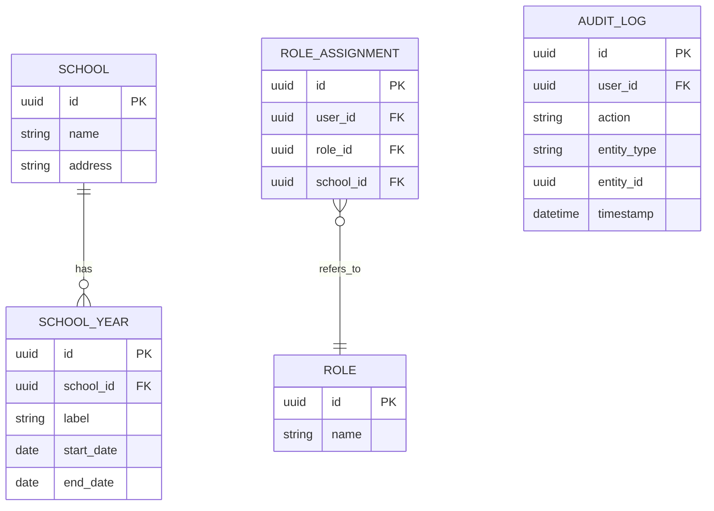
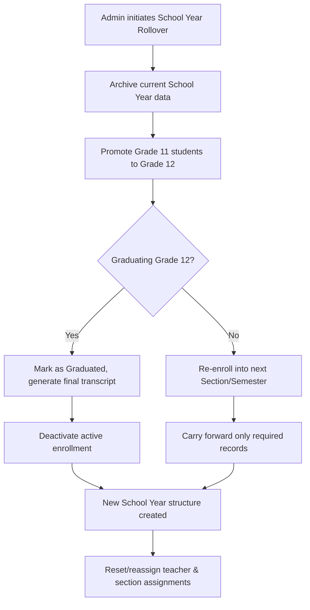

# Module 15: System Administration

## System Overview

This file is one module out of a set of module-context files for the **Senior High School LMS**
— a Learning Management System for Grades 11–12 under the Philippine K-12 Tracks/Strands
curriculum (Academic, TVL, Sports, Arts & Design tracks; STEM, ABM, HUMSS, GAS, etc. strands),
adaptable to any SHS setup.

**Tech stack:** Laravel (backend/API) + Vue.js (frontend SPA). See **Section 0 — Tech Stack** in
[`senior-high-school-lms-plan.md`](../senior-high-school-lms-plan.md) for the full stack decision,
the strict scalability/readability rule that governs all code in this project, and an explanation
of the Laravel file structure.

**Full plan:** [`senior-high-school-lms-plan.md`](../senior-high-school-lms-plan.md) contains
the complete module list, the full ERD, all module flowcharts, cross-cutting considerations,
and build phases. This file extracts and expands only what's relevant to this one module so it
can be handed to a developer (or an AI coding assistant) as a self-contained brief.

---

## Function
School year setup/rollover, curriculum configuration, backup/audit logs, permission management.

**Keep in mind:**
- **School year rollover** is one of the trickiest features — promoting Grade 11 → Grade 12, archiving old sections, carrying forward only the right data (not duplicating). Design this as a first-class workflow, not an afterthought.

---

## Data Model (relevant slice of the master ERD)

---

## Module Flow

---

## Cross-Cutting Concerns That Apply Here

- **Multi-tenancy:** If this LMS will serve multiple schools, isolate data per school (tenant_id) from day one — retrofitting multi-tenancy later is painful.
- **Auditability:** Grades, attendance, and guidance records all need "who changed what, when" trails — build this in from the start, it's expensive to bolt on later.

---

## Build Phase

**Phase 6 — Ops Hardening** (see the master plan's Suggested Build Phases for the full sequence).

---

## Implementation Notes

School year rollover is the trickiest single workflow in the whole system — model it as an explicit, resumable job/pipeline, not an ad hoc script.

---

## Related Modules

- [Module 1: User & Role Management](./01-user-role-management.md)
- [Module 2: Enrollment & Academic Structure](./02-enrollment-academic-structure.md)
