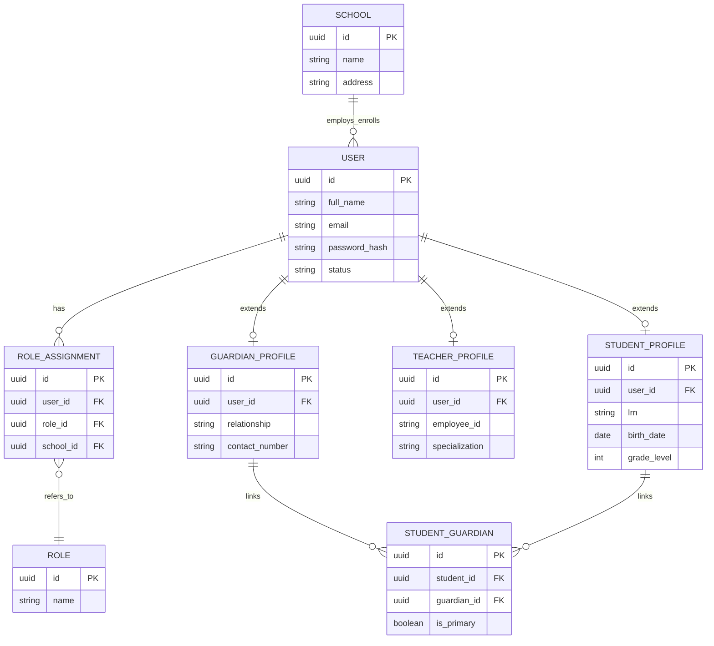
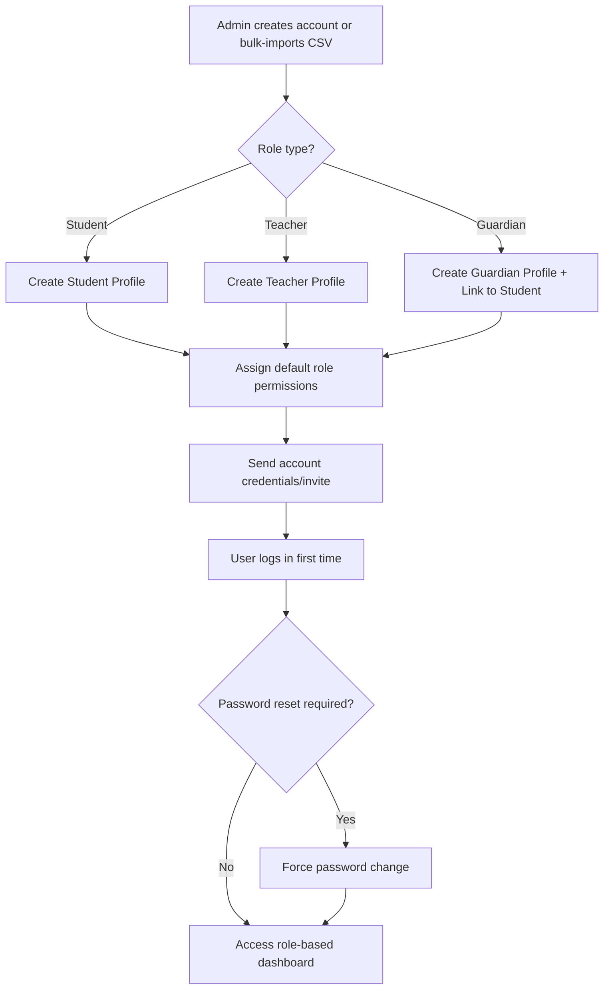

# Module 1: User & Role Management

## System Overview

This file is one module out of a set of module-context files for the **Senior High School LMS**
— a Learning Management System for Grades 11–12 under the Philippine K-12 Tracks/Strands
curriculum (Academic, TVL, Sports, Arts & Design tracks; STEM, ABM, HUMSS, GAS, etc. strands),
adaptable to any SHS setup.

**Tech stack (as planned):** Laravel (backend/API) + Vue.js (frontend SPA). *Correction: the actual codebase never adopted Vue — it is server-rendered Laravel Blade + Alpine.js + ApexCharts (see `package.json`; no Vue dependency exists). See Module 16 and `modules/README.md` for real implementation status.* See **Section 0 — Tech Stack** in
[`senior-high-school-lms-plan.md`](../senior-high-school-lms-plan.md) for the full stack decision,
the strict scalability/readability rule that governs all code in this project, and an explanation
of the Laravel file structure.

**Full plan:** [`senior-high-school-lms-plan.md`](../senior-high-school-lms-plan.md) contains
the complete module list, the full ERD, all module flowcharts, cross-cutting considerations,
and build phases. This file extracts and expands only what's relevant to this one module so it
can be handed to a developer (or an AI coding assistant) as a self-contained brief.

---

## Function
Central identity system for Admins, Registrars, Teachers/Advisers, Students, Parents/Guardians, and Guidance Counselors. Handles authentication, role-based access control (RBAC), and profile data.

**Keep in mind:**
- One student may have multiple guardians; one guardian may have multiple children in the system.
- Teachers can be "subject teachers" and/or "advisers" (homeroom) — these are different permission scopes.
- Support account status: active, suspended, graduated, transferred-out.
- Plan for bulk import (CSV) at start-of-year enrollment.

---

## Data Model (relevant slice of the master ERD)

---

## Module Flow

---

## Cross-Cutting Concerns That Apply Here

- **Data privacy:** Student data (especially minors) requires strict compliance (e.g., Philippine Data Privacy Act / DPA 2012, or GDPR/FERPA equivalents if international). Encrypt sensitive fields, log all access to guidance/counseling records.
- **Multi-tenancy:** If this LMS will serve multiple schools, isolate data per school (tenant_id) from day one — retrofitting multi-tenancy later is painful.
- **Auditability:** Grades, attendance, and guidance records all need "who changed what, when" trails — build this in from the start, it's expensive to bolt on later.

---

## Build Phase

**Phase 1 — Foundation** (see the master plan's Suggested Build Phases for the full sequence).

---

## Implementation Notes

This is the identity/auth backbone every other module depends on — build it first and keep it framework-agnostic where possible (thin controllers, logic in services).

---

## Implementation Status

*(verified against the codebase, Sept 2026 — see `modules/README.md` for the project-wide table)*

**Done:**
- Session-based login (`WebAuthController::login`) — bcrypt validation, auto-rehash on outdated hash, redirects by role.
- Forced first-login password change: `PasswordChangeController` + `EnsurePasswordIsChanged` middleware (`password.changed` alias), covered by `tests/Feature/ForcedPasswordChangeTest.php` (7 passing tests).
- Admin-driven account CRUD (`WebAuthController::adminUsers*`): create/edit/list/show, soft delete (`is_deleted`) + restore. Creates the matching `Student` or `Teacher` profile row inline when the role is set.
- Models: `User`, `Student`, `Teacher`.

**Partial / gaps:**
- Role checks are ad hoc `abort_unless(in_array($request->user()->role, [...]))` calls repeated per controller — no Policies/Gates yet.
- `Guardian` model does not exist even though the `guardians` table does (see Module 12).
- Self-service registration and password-reset flows described in earlier drafts of this doc were removed from the codebase — account creation is Admin-only via `/admin/users`.

**Not started:**
- Bulk CSV import for start-of-year enrollment.
- Account status lifecycle beyond `Active`/`is_deleted` (no suspended/graduated/transferred-out states).
- Multi-guardian-to-student linking UI (`student_guardians` table exists, unused).

---

## Related Modules

- [Module 2: Enrollment & Academic Structure](./02-enrollment-academic-structure.md)
- [Module 12: Parent/Guardian Portal](./12-parent-guardian-portal.md)
- [Module 15: System Administration](./15-system-administration.md)
