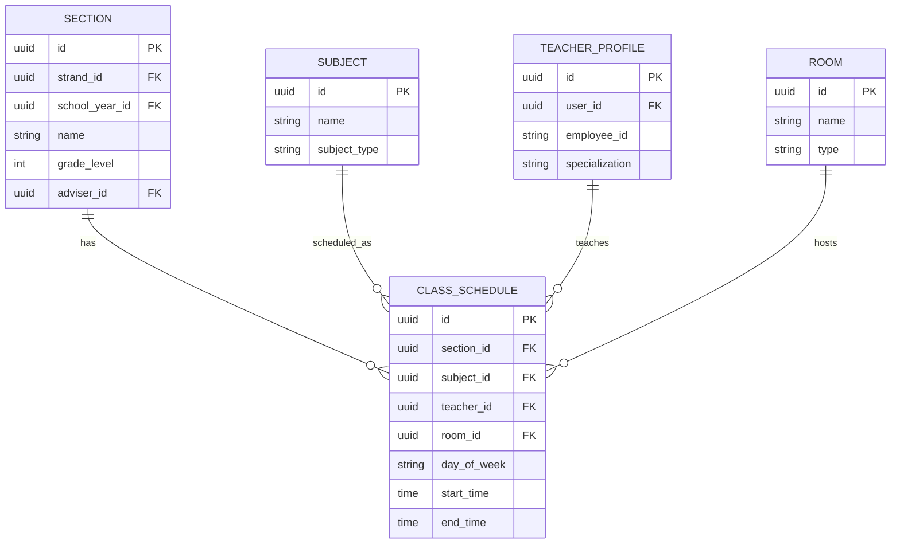
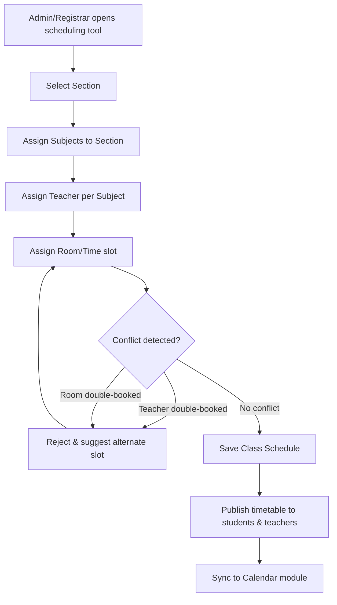

# Module 3: Class & Scheduling

## System Overview

This file is one module out of a set of module-context files for the **Senior High School LMS**
— a Learning Management System for Grades 11–12 under the Philippine K-12 Tracks/Strands
curriculum (Academic, TVL, Sports, Arts & Design tracks; STEM, ABM, HUMSS, GAS, etc. strands),
adaptable to any SHS setup.

**Tech stack (as planned):** Laravel (backend/API) + Vue.js (frontend SPA). *Correction: the actual codebase never adopted Vue — it is server-rendered Laravel Blade + Alpine.js + ApexCharts (see `package.json`; no Vue dependency exists). See Module 16 and `modules/README.md` for real implementation status.* See **Section 0 — Tech Stack** in
[`senior-high-school-lms-plan.md`](../senior-high-school-lms-plan.md) for the full stack decision,
the strict scalability/readability rule that governs all code in this project, and an explanation
of the Laravel file structure.

**Full plan:** [`senior-high-school-lms-plan.md`](../senior-high-school-lms-plan.md) contains
the complete module list, the full ERD, all module flowcharts, cross-cutting considerations,
and build phases. This file extracts and expands only what's relevant to this one module so it
can be handed to a developer (or an AI coding assistant) as a self-contained brief.

---

## Function
Assigns subjects to sections, teachers to subjects, and generates timetables. Handles room/resource allocation for lab-based strands (STEM, TVL).

**Keep in mind:**
- Conflict detection (teacher double-booked, room double-booked).
- Half-day/shifting schedules (common in public SHS with limited classrooms).
- Immersion/OJT scheduling for TVL and work-immersion requirements — this is a block schedule outside normal classes.

---

## Data Model (relevant slice of the master ERD)

---

## Module Flow

---

## Cross-Cutting Concerns That Apply Here

- **Offline resilience:** Design APIs to tolerate spotty connections (queue submissions, retry uploads).
- **Auditability:** Grades, attendance, and guidance records all need "who changed what, when" trails — build this in from the start, it's expensive to bolt on later.

---

## Build Phase

**Phase 2 — Daily Operations** (see the master plan's Suggested Build Phases for the full sequence).

---

## Implementation Notes

CLASS_SCHEDULE is the pivot table nearly every operational module (Attendance, Materials, Assignments, Quizzes) hangs off of — get its constraints right early.

---

## Implementation Status

*(verified against the codebase, Sept 2026 — see `modules/README.md` for the project-wide table)*

**Done:**
- `Schedule` model (`schedules` table) with `section()`, `subject()`, `teacher()`, `assignments()`, `quizzes()` relations — built as supporting infrastructure for Module 16 (Student Dashboard), directly reusable for this module's own purpose.

**Not started:**
- No `ScheduleController`, no admin/teacher UI to build timetables.
- No conflict detection (teacher/room double-booking).
- No `Room` model (table exists, used only via raw `DB::table('rooms')` in tests).
- Teacher (`teacher/schedule/index.blade.php`) and student (`student/schedule/index.blade.php`) schedule views are unwired stubs.
- No immersion/OJT block-schedule support.

---

## Related Modules

- [Module 2: Enrollment & Academic Structure](./02-enrollment-academic-structure.md)
- [Module 4: Attendance](./04-attendance.md)
- [Module 9: Calendar & Events](./09-calendar-events.md)
