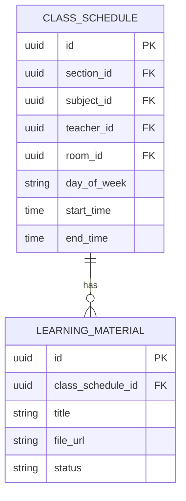
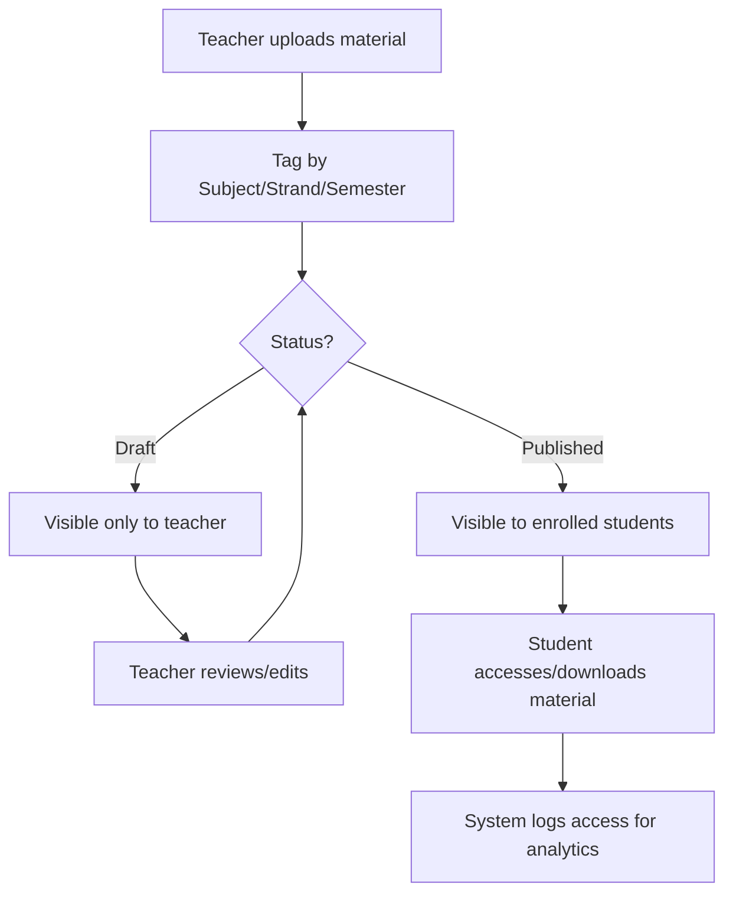

# Module 5: Content & Learning Materials

## System Overview

This file is one module out of a set of module-context files for the **Senior High School LMS**
— a Learning Management System for Grades 11–12 under the Philippine K-12 Tracks/Strands
curriculum (Academic, TVL, Sports, Arts & Design tracks; STEM, ABM, HUMSS, GAS, etc. strands),
adaptable to any SHS setup.

**Tech stack (as planned):** Laravel (backend/API) + Vue.js (frontend SPA). *Correction: the actual codebase never adopted Vue — it is server-rendered Laravel Blade + Alpine.js + ApexCharts (see `package.json`; no Vue dependency exists). See Module 16 and `modules/README.md` for real implementation status.* See **Section 0 — Tech Stack** in
[`senior-high-school-lms-plan.md`](../senior-high-school-lms-plan.md) for the full stack decision,
the strict scalability/readability rule that governs all code in this project, and an explanation
of the Laravel file structure.

**Full plan:** [`senior-high-school-lms-plan.md`](../senior-high-school-lms-plan.md) contains
the complete module list, the full ERD, all module flowcharts, cross-cutting considerations,
and build phases. This file extracts and expands only what's relevant to this one module so it
can be handed to a developer (or an AI coding assistant) as a self-contained brief.

---

## Function
Upload/organize modules, videos, slides, and self-learning kits per subject; versioning of materials.

**Keep in mind:**
- Support offline-friendly formats (many SHS students have limited connectivity) — downloadable PDFs, low-bandwidth video links.
- Materials should be scoped by subject + strand + semester, not a flat file dump.
- Access control: draft vs published content.

---

## Data Model (relevant slice of the master ERD)

---

## Module Flow

---

## Cross-Cutting Concerns That Apply Here

- **Offline resilience:** Design APIs to tolerate spotty connections (queue submissions, retry uploads).
- **Accessibility:** Screen-reader support and low-bandwidth modes matter for equitable access.

---

## Build Phase

**Phase 2 — Daily Operations** (see the master plan's Suggested Build Phases for the full sequence).

---

## Implementation Notes

Keep storage abstracted (Laravel Filesystem/S3-compatible driver) so large media files don't bloat the primary database or the app server disk.

---

## Implementation Status

*(verified against the codebase, Sept 2026 — see `modules/README.md` for the project-wide table)*

**Done:**
- `LearningMaterial` model (`app/Models/LearningMaterial.php`) — `forTeacher()` scope (materials across a teacher's schedules) and `visibleToSection()` scope (Published-only, section-scoped) drive the two list views.
- `TeacherMaterialController` (`index`, `store`, `update`, `destroy`) wired to `/teacher/materials` (`routes/web.php`) — full upload/edit/delete CRUD, scoped so a teacher can only manage materials on their own schedules (`authorizeOwnership()`), with class/status filters and Draft/Published/Archived stat tiles.
- `StudentMaterialController` (`index`) wired to `/student/materials` — lists only `Published` materials for the student's active-enrollment section, grouped by subject.
- `MaterialDownloadController` (`show`/download, `preview`) wired to `/materials/{material}/download` and `/materials/{material}/preview` — both routed through a shared `authorizeAccess()` gate: a teacher may only access materials on their own schedules; a student only `Published` materials in their own section. Files are stored on the `local` (non-public) disk so drafts never get a guessable URL; `preview()` streams inline (`Storage::response()`) so PDFs/videos render in-browser, `show()` forces a download.
- Teacher UI (`teacher/materials/index.blade.php`): upload/edit modal with a pre-upload blob preview (PDF via `<iframe>`, video via `<video>`, other types show name/size) before the file is submitted, plus a "Current file" thumbnail card when editing an existing material. Student UI (`student/materials/index.blade.php`): materials grouped by subject with Preview/Download actions per item.
- `database/seeders/LearningMaterialSeeder.php` seeds demo Published/Draft materials for the demo teacher/schedule.
- `tests/Feature/TeacherMaterialTest.php` and `tests/Feature/StudentMaterialTest.php` — teacher upload/update/delete/ownership checks, teacher preview/ownership, student Published-only visibility, section scoping, draft-blocking, preview/download access checks — all passing (part of the project's 42/42 passing suite).

**Not started / partial (gaps vs. this doc's original spec):**
- **No versioning.** `update()` replaces `file_url` in place and deletes the old file from storage — there is no history of prior file versions, despite this module's stated "Function" including "versioning of materials."
- **No offline-friendly-format handling.** Uploads accept `pdf,doc,docx,ppt,pptx,xls,xlsx,mp4,zip` with a flat 20 MB cap; there's no low-bandwidth video link support or format-specific guidance called out in the original "Keep in mind" notes.
- **No access analytics.** The flowchart's "System logs access for analytics" step isn't implemented — downloads/previews aren't logged anywhere (no audit-log integration).
- Materials are scoped by **schedule** (which already implies subject + section), not independently taggable by strand/semester the way the original data model implies — acceptable given schedules already carry that context, but there's no semester-level "archive all of last semester's materials" bulk action.

---

## Related Modules

- [Module 3: Class & Scheduling](./03-class-scheduling.md)
- [Module 6: Assignments, Quizzes & Assessments](./06-assignments-quizzes-assessments.md)
