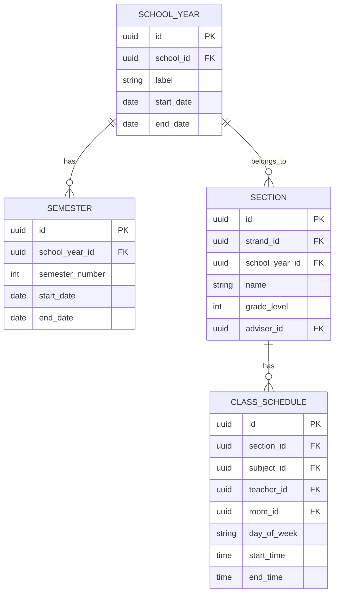
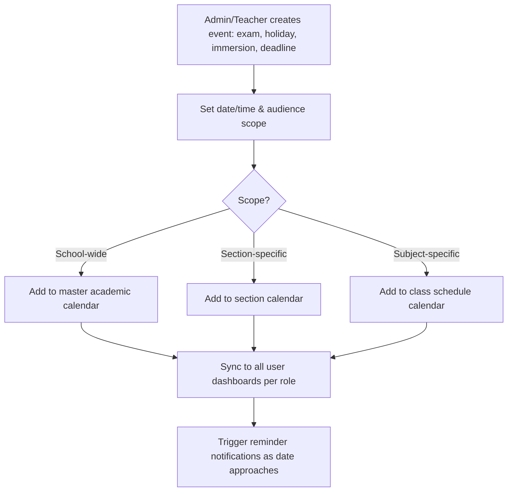

# Module 9: Calendar & Events

## System Overview

This file is one module out of a set of module-context files for the **Senior High School LMS**
— a Learning Management System for Grades 11–12 under the Philippine K-12 Tracks/Strands
curriculum (Academic, TVL, Sports, Arts & Design tracks; STEM, ABM, HUMSS, GAS, etc. strands),
adaptable to any SHS setup.

**Tech stack (as planned):** Laravel (backend/API) + Vue.js (frontend SPA). *Correction: the actual codebase never adopted Vue — it is server-rendered Laravel Blade + Alpine.js + ApexCharts (see `package.json`; no Vue dependency exists). See Module 16 and `modules/README.md` for real implementation status.* See **Section 0 — Tech Stack** in
[`senior-high-school-lms-plan.md`](../senior-high-school-lms-plan.md) for the full stack decision,
the strict scalability/readability rule that governs all code in this project, and an explanation
of the Laravel file structure.

**Full plan:** [`senior-high-school-lms-plan.md`](../senior-high-school-lms-plan.md) contains
the complete module list, the full ERD, all module flowcharts, cross-cutting considerations,
and build phases. This file extracts and expands only what's relevant to this one module so it
can be handed to a developer (or an AI coding assistant) as a self-contained brief.

---

## Function
Academic calendar, exam schedules, holidays, deadlines, school events, immersion schedules.

**Keep in mind:**
- Should sync per-role (a student sees their own section's events; a teacher sees all sections they handle).

---

## Data Model (relevant slice of the master ERD)

---

## Module Flow

---

## Cross-Cutting Concerns That Apply Here

- **Localization:** Support Filipino/English bilingual UI if targeting Philippine public schools.

---

## Build Phase

**Phase 4 — Engagement** (see the master plan's Suggested Build Phases for the full sequence).

---

## Implementation Notes

GAP: the current ERD (section 4) has no dedicated EVENT table — Calendar reuses SECTION/CLASS_SCHEDULE dates today. Add an EVENT entity (title, scope, date range, audience) before building this module so holidays/exams/immersion aren't shoehorned into scheduling tables.

---

## Implementation Status

*(verified against the codebase, Sept 2026 — see `modules/README.md` for the project-wide table)*

**Done:**
- `CalendarController` (`index`, `events`, `store`, `update`, `destroy`) wired to `/calendar` and `/calendar/events` (`routes/web.php`), backed by `CalendarEventService::feedFor()` — a real service-layer class, not query logic in the controller.
- `shared/calendar/index.blade.php` + `resources/js/calendar.js` render a full FullCalendar month view (create/edit/delete via Alpine-driven modals), fed by the JSON `events` endpoint.
- `ScheduleEvent::upcomingForStudent()` (14-day dashboard widget, Module 16 dependency) and the newer `ScheduleEvent::forStudentCalendar()` (arbitrary date-range scope powering the month/week navigation) both exist.
- `CalendarEventService::feedFor()` merges three sources into one feed shape: the student's personal/section-scoped `ScheduleEvent` rows, plus `Assignment::forSectionCalendar()` and `Quiz::forSectionCalendar()` due dates (new scopes on those models, see Module 6) — so assignment/quiz deadlines already show up on the calendar without a separate UI.
- `StoreCalendarEventRequest` validates event creation/update (`title`, `description`, `start_datetime`, `end_datetime`).
- `tests/Feature/CalendarControllerTest.php` — 9 passing tests: index renders, feed merges all three sources, feed excludes other sections/students, create/update/delete a personal event, validation errors, a student cannot edit a teacher-created event, non-student roles get 403.

**Not started / partial:**
- Every controller action is `abort_unless($request->user()->role === 'Student', 403)` — **admin/teacher event creation and viewing don't exist yet.** This directly contradicts this module's own "Keep in mind" note (a teacher should see all sections they handle) and the flowchart's "Admin/Teacher creates event" step — the only way a non-personal event reaches `schedule_events` today is by hand/seed, e.g. the "Teacher-created" fixture in the test file.
- No recurring-event support.
- No school-wide (audience-scoped) events — only "personal" (student-created) and section-scoped events are modeled; the flowchart's School-wide/Section/Subject scope split isn't implemented.

---

## Related Modules

- [Module 3: Class & Scheduling](./03-class-scheduling.md)
- [Module 14: Notifications & Alerts](./14-notifications-alerts.md)
