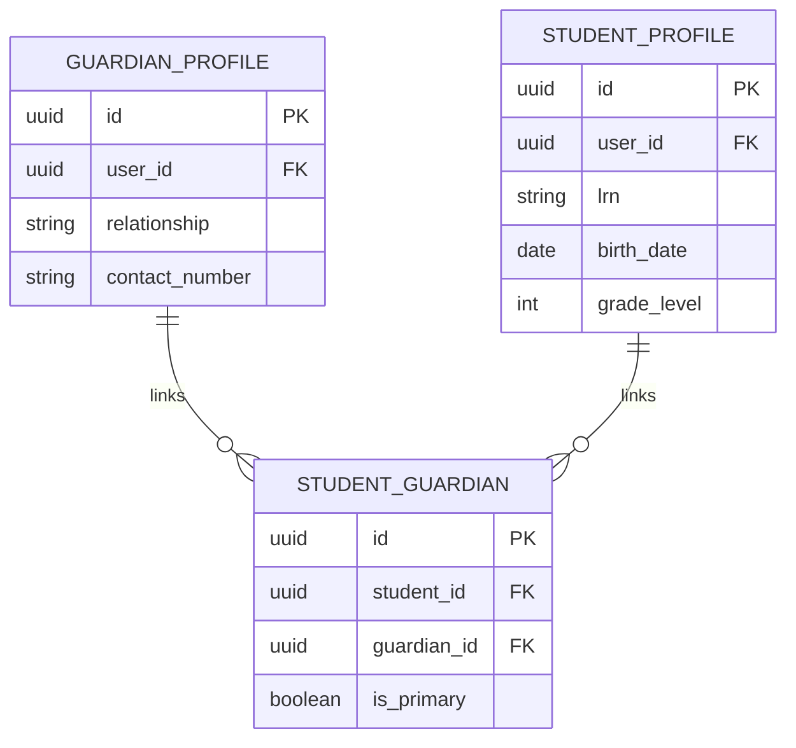
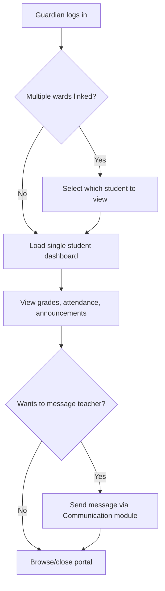

# Module 12: Parent/Guardian Portal

## System Overview

This file is one module out of a set of module-context files for the **Senior High School LMS**
— a Learning Management System for Grades 11–12 under the Philippine K-12 Tracks/Strands
curriculum (Academic, TVL, Sports, Arts & Design tracks; STEM, ABM, HUMSS, GAS, etc. strands),
adaptable to any SHS setup.

**Tech stack (as planned):** Laravel (backend/API) + Vue.js (frontend SPA). *Correction: the actual codebase never adopted Vue — it is server-rendered Laravel Blade + Alpine.js + ApexCharts (see `package.json`; no Vue dependency exists). See Module 16 and `modules/README.md` for real implementation status.* See **Section 0 — Tech Stack** in
[`senior-high-school-lms-plan.md`](../senior-high-school-lms-plan.md) for the full stack decision,
the strict scalability/readability rule that governs all code in this project, and an explanation
of the Laravel file structure.

**Full plan:** [`senior-high-school-lms-plan.md`](../senior-high-school-lms-plan.md) contains
the complete module list, the full ERD, all module flowcharts, cross-cutting considerations,
and build phases. This file extracts and expands only what's relevant to this one module so it
can be handed to a developer (or an AI coding assistant) as a self-contained brief.

---

## Function
View-only access to grades, attendance, announcements, and messaging with teachers.

**Keep in mind:**
- Must support guardians with multiple children — a single login should switch between wards.

---

## Data Model (relevant slice of the master ERD)

---

## Module Flow

---

## Cross-Cutting Concerns That Apply Here

- **Data privacy:** Student data (especially minors) requires strict compliance (e.g., Philippine Data Privacy Act / DPA 2012, or GDPR/FERPA equivalents if international). Encrypt sensitive fields, log all access to guidance/counseling records.
- **Accessibility:** Screen-reader support and low-bandwidth modes matter for equitable access.

---

## Build Phase

**Phase 4 — Engagement** (see the master plan's Suggested Build Phases for the full sequence).

---

## Implementation Notes

This module is mostly a read-only composite view over Grading (7), Attendance (4), Communication (8), and Reports (13) — avoid duplicating their data, query through them.

---

## Implementation Status

*(verified against the codebase, Sept 2026 — see `modules/README.md` for the project-wide table)*

**Partial / gaps:**
- The `guardians` table exists (migration `2026_09_20_000004_create_guardians_table.php`, `user_id`/`full_name`/`relationship`/`contact_number`), and `students.guardian_id` is a nullable FK into it — but there is **no `Guardian` Eloquent model** in `app/Models/`.

**Not started:**
- No guardian portal routes, controller, or views of any kind.
- No multi-ward (one guardian, multiple children) switching UI.
- The `student_guardians` many-to-many table referenced in Module 1 is unused.

---

## Related Modules

- [Module 1: User & Role Management](./01-user-role-management.md)
- [Module 7: Grading & Report Cards](./07-grading-report-cards.md)
- [Module 4: Attendance](./04-attendance.md)
- [Module 8: Communication & Announcements](./08-communication-announcements.md)
- [Module 13: Reports & Analytics](./13-reports-analytics.md)
