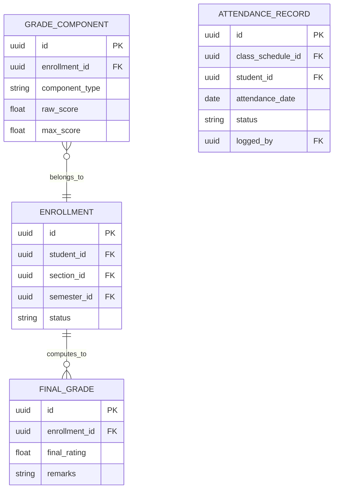
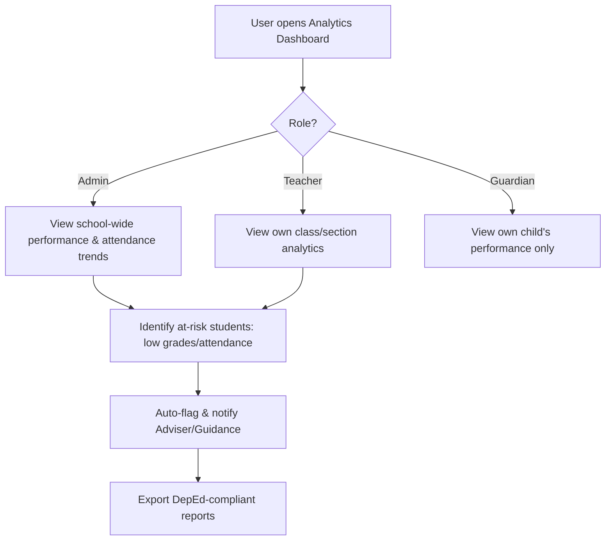

# Module 13: Reports & Analytics

## System Overview

This file is one module out of a set of module-context files for the **Senior High School LMS**
— a Learning Management System for Grades 11–12 under the Philippine K-12 Tracks/Strands
curriculum (Academic, TVL, Sports, Arts & Design tracks; STEM, ABM, HUMSS, GAS, etc. strands),
adaptable to any SHS setup.

**Tech stack (as planned):** Laravel (backend/API) + Vue.js (frontend SPA). *Correction: the actual codebase never adopted Vue — it is server-rendered Laravel Blade + Alpine.js + ApexCharts (see `package.json`; no Vue dependency exists). See Module 16 and `modules/README.md` for real implementation status.* See **Section 0 — Tech Stack** in
[`senior-high-school-lms-plan.md`](../senior-high-school-lms-plan.md) for the full stack decision,
the strict scalability/readability rule that governs all code in this project, and an explanation
of the Laravel file structure.

**Full plan:** [`senior-high-school-lms-plan.md`](../senior-high-school-lms-plan.md) contains
the complete module list, the full ERD, all module flowcharts, cross-cutting considerations,
and build phases. This file extracts and expands only what's relevant to this one module so it
can be handed to a developer (or an AI coding assistant) as a self-contained brief.

---

## Function
Dashboards for at-risk students (low grades/attendance), class performance analytics, DepEd-compliant exportable reports.

**Keep in mind:**
- Needs role-scoped dashboards (Admin sees school-wide, Teacher sees their own classes, Guardian sees their child only).

---

## Data Model (relevant slice of the master ERD)

---

## Module Flow

---

## Cross-Cutting Concerns That Apply Here

- **Scalability of grading rules:** Different strands/tracks have different weight formulas — model this as data (a "Grading Template" table), not code.
- **Auditability:** Grades, attendance, and guidance records all need "who changed what, when" trails — build this in from the start, it's expensive to bolt on later.

---

## Build Phase

**Phase 5 — Oversight** (see the master plan's Suggested Build Phases for the full sequence).

---

## Implementation Notes

Purely a read/aggregation layer — no new entities of its own. Consider a queued job + cached/materialized summary tables so dashboards don't run heavy queries live.

---

## Implementation Status

*(verified against the codebase, Sept 2026 — see `modules/README.md` for the project-wide table)*

**Done:**
- `ReportController` + `/admin/reports` — a real, working audit-log dashboard: filters (date range, user, action type), summary stat cards, and a "top active users" breakdown. This is the furthest-along of the not-yet-fully-built modules.

**Not started:**
- No at-risk-student dashboards, no DepEd-compliant export formats (these depend on Modules 4/7 which don't exist yet).
- Reporting is currently scoped to audit-log activity only, not academic/attendance analytics.

---

## Related Modules

- [Module 4: Attendance](./04-attendance.md)
- [Module 7: Grading & Report Cards](./07-grading-report-cards.md)
- [Module 10: Guidance & Counseling](./10-guidance-counseling.md)
- [Module 12: Parent/Guardian Portal](./12-parent-guardian-portal.md)
