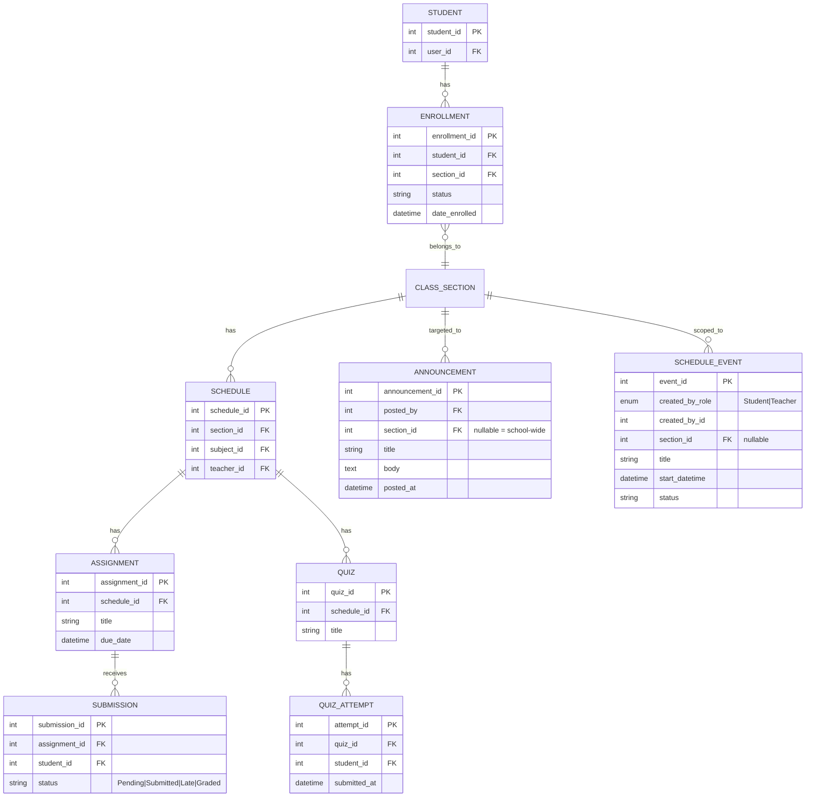
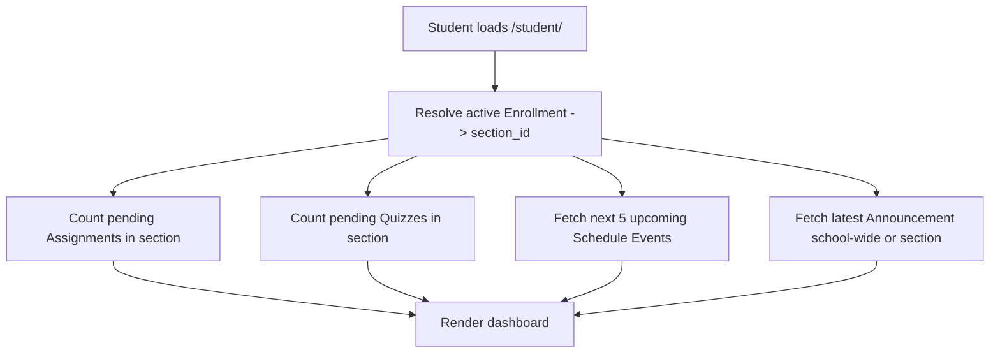

# Module 16: Student Dashboard

## System Overview

This file is one module out of a set of module-context files for the **Senior High School LMS**.
Unlike modules 1–15 (which describe conceptual/future scope against the master ERD), this module
describes a **concrete, implementation-ready feature** built against the LMS's actual current
Laravel + Blade codebase (not the Vue SPA described in the master plan's §0 — that stack was never
adopted; this project uses server-rendered Blade + Alpine.js + ApexCharts).

**Full plan:** [`senior-high-school-lms-plan.md`](../senior-high-school-lms-plan.md).

---

## Function

The Student Dashboard (`/student/`, `resources/views/student/dashboard.blade.php`) gives a student
an at-a-glance summary of what needs their attention, pulling from Modules 6, 8, and 9:

1. **Pending Assignments** — count of assignments in the student's current section with no
   completed submission yet.
2. **Pending Quizzes** — count of quizzes in the student's current section the student hasn't
   completed an attempt for.
3. **Calendar widget** — the next few upcoming events (from `schedule_events`) relevant to the
   student, with a link to the full calendar.
4. **Latest Announcement** — the most recent announcement visible to the student (school-wide or
   targeted at their section).

**Keep in mind:**
- A student's "current section" is derived from their most recent `Enrolled` enrollment
  (`enrollments.status = 'Enrolled'`), not a static field — a student can have multiple enrollment
  rows across semesters/years.
- "Pending" must not silently include withdrawn/dropped students' old sections — always filter
  through the *active* enrollment.
- This is a read/aggregation feature only — no new source-of-truth tables, no new business rules to
  invent; it reads existing `assignments`, `quizzes`, `submissions`, `quiz_attempts`,
  `announcements`, `schedule_events` tables that already exist in migrations but have **zero
  Eloquent models today**.

---

## Definitions (precise, so the counts are unambiguous)

| Term | Rule |
|---|---|
| Student's active section | `Enrollment` where `student_id = X AND status = 'Enrolled'`, most recent by `date_enrolled` |
| Pending assignment | Belongs to a `schedule` in the student's active section, **and** has no `submission` row with `status IN ('Submitted','Late','Graded')` for this student |
| Pending quiz | Belongs to a `schedule` in the student's active section, **and** has no `quiz_attempt` row with `submitted_at IS NOT NULL` for this student |
| Upcoming calendar event | `schedule_events` where `status = 'Scheduled'` and `start_datetime >= now()`, and either (a) `created_by_role = 'Student' AND created_by_id = <student_id>` (personal events), or (b) `section_id = <active section_id>` — ordered by `start_datetime`, limited to the next 5 within 14 days |
| Latest announcement | `announcements` where `section_id IS NULL` (school-wide) **or** `section_id = <active section_id>`, ordered by `posted_at DESC`, limit 1 |

---

## Data Model (actual schema — auto-increment PKs, not the uuid master ERD)

---

## Module Flow

---

## Files to Create

| File | Purpose |
|---|---|
| `app/Models/Schedule.php` | Maps `schedules` table; `belongsTo(ClassSection)`, `hasMany(Assignment)`, `hasMany(Quiz)` |
| `app/Models/Assignment.php` | Maps `assignments`; `belongsTo(Schedule)`, `hasMany(Submission)`, scope `scopePendingForStudent()` |
| `app/Models/Submission.php` | Maps `submissions`; `belongsTo(Assignment)`, `belongsTo(Student)` |
| `app/Models/Quiz.php` | Maps `quizzes`; `belongsTo(Schedule)`, `hasMany(QuizAttempt)`, scope `scopePendingForStudent()` |
| `app/Models/QuizAttempt.php` | Maps `quiz_attempts`; `belongsTo(Quiz)`, `belongsTo(Student)` |
| `app/Models/Announcement.php` | Maps `announcements`; `belongsTo(User, 'posted_by')`, `belongsTo(ClassSection, 'section_id')`, scope `scopeVisibleToSection()` |
| `app/Models/ScheduleEvent.php` | Maps `schedule_events`; scope `scopeUpcomingForStudent()` |
| `app/Services/Dashboard/StudentDashboardService.php` | Orchestrates the 4 queries above into one array for the view (business logic lives here per the project's "thin controllers, fat services" rule) |
| `app/Http/Controllers/StudentDashboardController.php` | Replaces `WebAuthController::studentDashboard()`; calls the service, returns the view |
| `resources/views/student/quizzes/index.blade.php` | Minimal stub list page (mirrors the existing `student/assignments/index.blade.php` stub) so the "Pending Quizzes" card has somewhere to link |
| `tests/Feature/StudentDashboardTest.php` | Asserts pending counts, section-scoped announcement visibility, upcoming-event filtering (see Testing section) |

## Files to Modify

| File | Change |
|---|---|
| `app/Models/Student.php` | Add `activeEnrollment()` — `hasOne(Enrollment::class)->where('status','Enrolled')->latestOfMany('date_enrolled')` — reusable by every future module that needs "this student's current section" |
| `routes/web.php` | Remove `studentDashboard` route target from `WebAuthController`, point `student.dashboard` at `StudentDashboardController::index`; register `/student/assignments` (route was missing despite the view existing), `/student/quizzes`, `/calendar`, `/announcements` |
| `app/Http/Controllers/WebAuthController.php` | Remove `studentDashboard()` method (moved out — keeps this already-large controller from growing further) |
| `resources/views/student/dashboard.blade.php` | Replace placeholder boxes with: 3 stat cards (Pending Assignments, Pending Quizzes, Upcoming Events count) using `components/cards/stat.blade.php`, 1 calendar list widget, 1 latest-announcement card. Delete the unused extra placeholder rows — no reason to keep empty scaffolding. |
| `resources/views/components/cards/stat.blade.php` | Flesh out the currently-empty stub into a real reusable component: `@props(['label', 'value', 'icon' => null, 'href' => null])` |

---

## Cross-Cutting Concerns That Apply Here

- **Scalability of grading rules:** not directly touched, but pending-assignment logic must stay data-driven (section-scoped), not hardcoded per subject.
- **Auditability:** read-only feature, no new audit surface.
- **Offline resilience:** dashboard queries should be cheap (indexed FKs already exist); no need for caching yet at current scale — add a short TTL cache only if this measurably becomes slow.

---

## Build Phase

**Phase 4 — Engagement** (per the master plan's Suggested Build Phases — this sits alongside Communication/Calendar/Parent Portal).

---

## Implementation Notes

- This module is the **first real consumer** of the `assignments`, `quizzes`, `quiz_attempts`,
  `submissions`, `announcements`, and `schedule_events` tables — creating their Eloquent models here
  unblocks Modules 5, 6, 8, and 9 as a side effect, it isn't scope creep, those tables were simply
  never modeled.
- Keep all four dashboard queries as **Eloquent scopes on their own models** (`scopePendingForStudent`,
  `scopeUpcomingForStudent`, `scopeVisibleToSection`) rather than raw query-builder code in the
  service — matches the project's "query complexity in Eloquent scopes" rule and makes each scope
  independently reusable (e.g., the same `Assignment::pendingForStudent()` scope will power the real
  Module 6 assignments list later).
- Do not build the full assignments/quiz-taking workflow as part of this task — only enough to
  produce accurate counts and a link target.

## Testing

`tests/Feature/StudentDashboardTest.php` covers:
1. Pending assignment count excludes assignments with a `Submitted`/`Late`/`Graded` submission.
2. Pending quiz count excludes quizzes with a completed (`submitted_at` not null) attempt.
3. Announcement visibility: a section-scoped announcement for another section is NOT shown; a
   school-wide (`section_id = null`) announcement IS shown.
4. Upcoming events: past events and events for other sections are excluded; a student's own
   personal event is included regardless of section.

**Status: implemented.** The pre-existing duplicate `create_sessions_table` migration that blocked
`php artisan test` was removed (the two files were byte-identical; keeping the earlier-dated one was
enough). Also fixed along the way: `Strand` model was missing `const UPDATED_AT = null`, which broke
every insert against the `strands` table (it has no `updated_at` column) — this affected any future
code creating strands, not just this test. `php artisan test` now runs clean: 13 passed (28
assertions), including the 4 new `StudentDashboardTest` cases above.

---

## Related Modules

- [Module 6: Assignments, Quizzes & Assessments](./06-assignments-quizzes-assessments.md)
- [Module 8: Communication & Announcements](./08-communication-announcements.md)
- [Module 9: Calendar & Events](./09-calendar-events.md)
- [Module 1: User & Role Management](./01-user-role-management.md)

